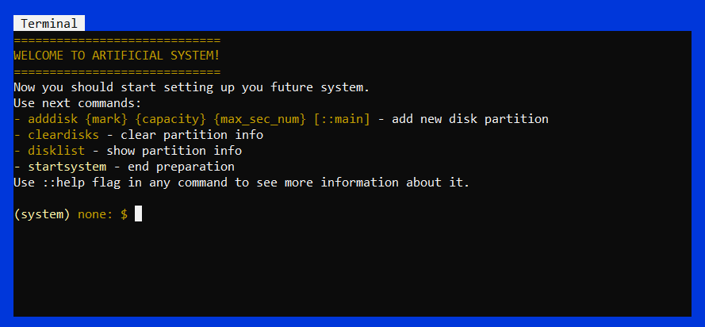
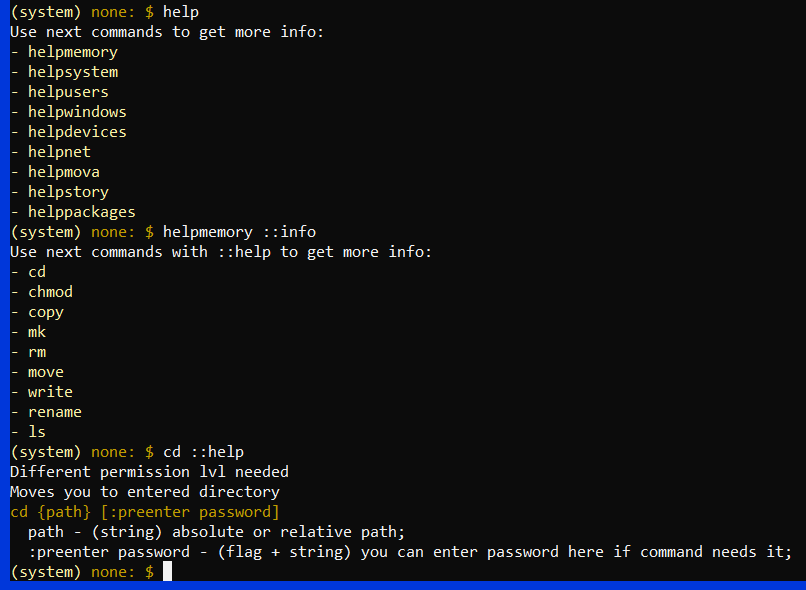
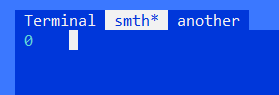

<div align="center">
  
# Artificial System
</div>

Welcome to the challenge game called ArtificialSystem! If you want to test what your brain is capable of, we invite you to play this game. Mysterious quests, unusual design, your imagination, and machine code programming are all inside Artificial. If you're ready to proceed, then go to the [Play](#play) section to view the guide and start playing. Good luck, let the brain be on your side!)


## Play
To run the game, use the command `run play.txt ::real`.  
To view a list of commands, use `help`. If you want to see a description of a specific command, then add `::help` or `::info` after the written command.  


When you reach **level 11 and above**, you will have additional commands available. Use the following commands to work with subwindows:  
```
SHIFT+Q - close the subwindow
SHIFT+S - save the subwindow
SHIFT+Z - go to the subwindow on the left
SHIFT+X - go to the subwindow on the right
```


The last note applies to **MOVA version 4 and above**, *don't worry if you don't understand what we are talking about, in the future you will understand and it will help you ;)*.  
Start input and output data from register №100, this will help you avoid unpredictable behavior, because some variables are created by the compiler, and you can overwrite them.
